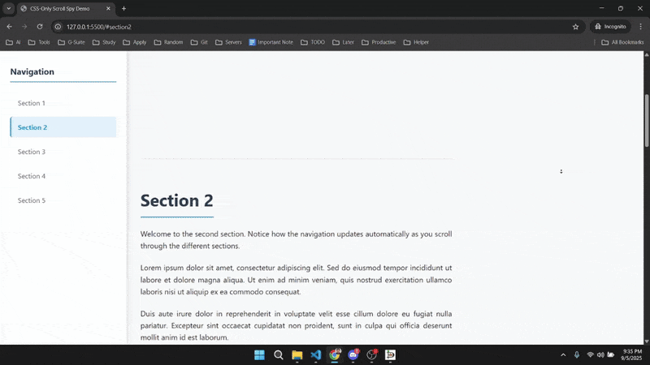

# CSS-Only Scroll Spy Demo

## Preview



A simple demonstration of CSS-only scroll spy functionality using the modern `scroll-target-group` property and `:target-current` pseudo-class.

## Features

- **Pure CSS Implementation**: No JavaScript required
- **Modern CSS Properties**: Uses `scroll-target-group` and `:target-current`
- **Responsive Design**: Works on both desktop and mobile devices
- **Browser Support Detection**: Includes fallback messaging for unsupported browsers
- **Clean UI**: Professional styling with smooth transitions

## Browser Support

This demo requires **Chrome 140+** (released August 2025) for full functionality. The CSS properties used are:

- `scroll-target-group: auto` - Enables automatic scroll targeting
- `:target-current` - Pseudo-class for styling the currently active target

For browsers that don't support these features, a warning message will be displayed.

## How It Works

1. **HTML Structure**: Navigation with anchor links pointing to page sections
2. **CSS Magic**: The `scroll-target-group: auto` property on the navigation enables automatic tracking
3. **Active Styling**: The `:target-current` pseudo-class automatically styles the active navigation link

## Key CSS Code

```css
nav {
  scroll-target-group: auto;
}

nav a:target-current {
  font-weight: bold;
  color: #3498db;
  background-color: #e3f2fd;
  border-left-color: #3498db;
}
```

## Project Structure

```text
scrollspy/
├── index.html          # Main HTML file with navigation and sections
├── styles.css          # CSS with scroll spy implementation
└── README.md           # This file
```

## Usage

1. Open `index.html` in Chrome 140+
2. Scroll through the page sections
3. Watch the navigation automatically highlight the current section
